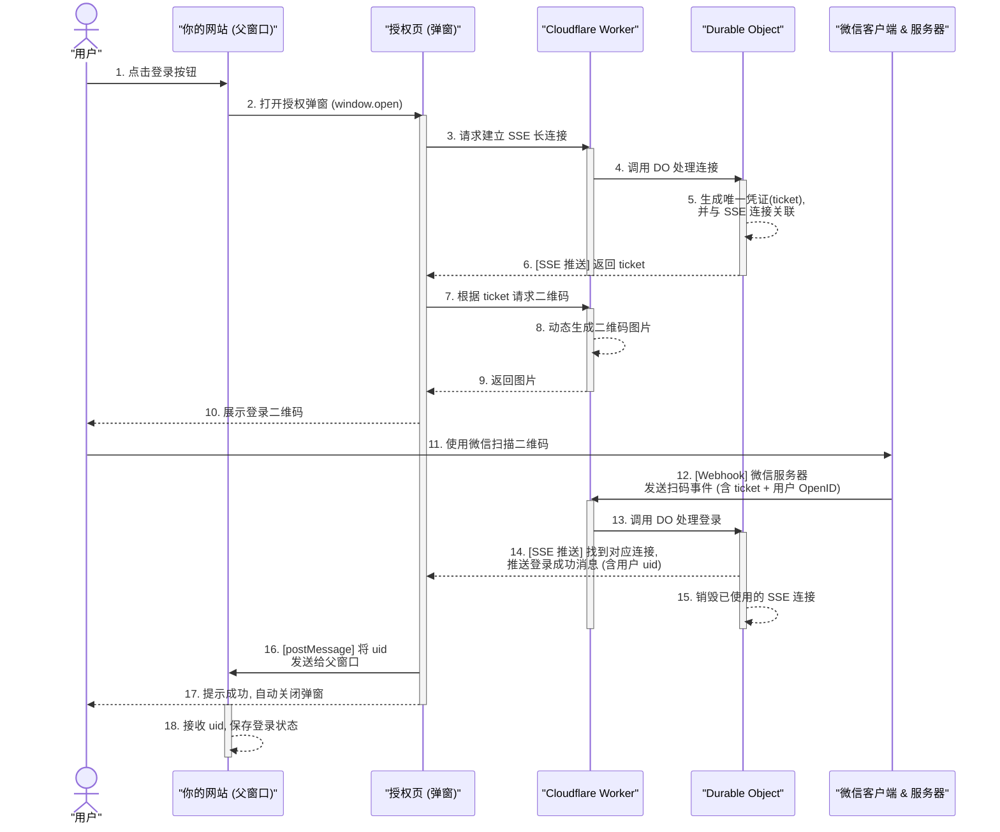

# 微信扫码登录 - 交互流程图与解析

## 1. 流程图 (Sequence Diagram)

下图详细描述了从用户点击登录到最终完成授权的完整步骤，涉及了 6 个关键参与方。

## 2. 流程解释

上图中的交互可以分为三个主要阶段：

### 阶段一：初始化与二维码生成 (步骤 1-10)

这个阶段的目标是为用户生成一个唯一的、有时效性的登录二维码。

1.  **用户发起登录**：用户在你的主网站上点击登录，触发 JS 事件。
2.  **打开授权页**：主网站通过 `window.open` 打开一个专门用于授权的页面（`/oauth`），这是一个独立的浏览器窗口/标签页。
3.  **建立 SSE 连接**：授权页加载后，立即向 Cloudflare Worker 发起一个 `EventSource` 请求 (`/oauth/sse`)，请求建立一个服务器发送事件 (SSE) 的长连接。
4.  **生成并关联凭证**：
    *   Worker 将请求转交给 Durable Object (DO)。
    *   DO 是一个有状态的对象，它生成一个唯一的字符串 `ticket` 作为临时凭证。
    *   最关键的一步：DO 在内存中将这个 `ticket` 和刚刚建立的 SSE 连接进行**绑定**（例如存入一个 Map 中）。
5.  **推送凭证并生成二维码**：
    *   DO 通过 SSE 连接将 `ticket` 推送回授权页。
    *   授权页收到 `ticket` 后，立刻向后端发起一个新的普通 HTTP 请求 (`/oauth/qrcode?ticket=...`)，请求将这个 `ticket` 字符串转换成二维码图片。
    *   后端动态生成二维码 SVG 并返回。
    *   授权页将二维码展示给用户。

### 阶段二：扫码与后端验证 (步骤 11-15)

这个阶段是用户通过微信与我们的后端服务进行交互的过程。

1.  **用户扫码**：用户使用微信扫描授权页上的二维码。
2.  **微信服务器通知**：
    *   微信客户端将二维码内容 (`ticket`) 和用户的 `OpenID` 发送给微信服务器。
    *   微信服务器再通过 **Webhook** 的方式，向我们在公众号后台配置的服务器地址（即 Cloudflare Worker）发送一个 POST 请求，请求体中包含了 `ticket` 和 `OpenID`。
3.  **后端处理登录**：
    *   Worker 收到请求后，将 `ticket` 和 `OpenID` (uid) 传递给 Durable Object。
    *   DO 使用 `ticket` 作为 Key，在内存的 Map 中查找之前绑定的 SSE 连接。
4.  **推送登录结果**：
    *   如果找到了对应的 SSE 连接（说明二维码有效且授权页还开着），DO 就会通过这个长连接，将包含 `uid` 的成功消息**推送**给授权页。
    *   推送完成后，DO 会立即销毁这个连接和 `ticket`，防止重复使用。

### 阶段三：前端通信与完成登录 (步骤 16-18)

这个阶段是将登录结果从授权弹窗传递回主网站，并完成最终操作。

1.  **跨窗口通信**：授权页通过 SSE 监听到了后端发来的成功消息和 `uid`。它使用浏览器的 `window.opener.postMessage()` API，将 `uid` 安全地发送给打开它的父窗口（你的主网站）。
2.  **关闭弹窗**：发送消息后，授权页会提示用户登录成功，并在短暂延迟后自动关闭 (`window.close()`)。
3.  **主网站完成登录**：主网站的 JS 一直在监听 `message` 事件。收到 `uid` 后，它会将 `uid` 存入 `localStorage`，更新 UI（例如显示用户头像和昵称），至此，整个登录流程闭环。
